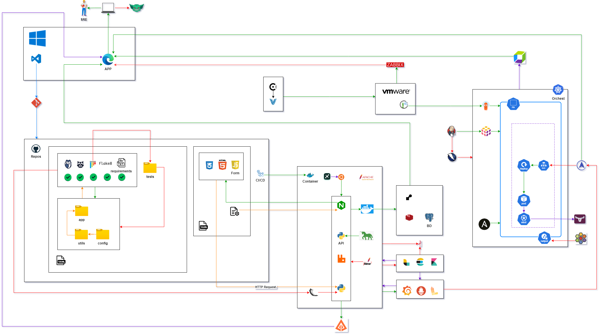

# Architecture Guide

## Contents

- [Architecture Guide](#architecture-guide)
  - [Contents](#contents)
  - [⚙️ System Overview](#️-system-overview)
  - [📊 Diagram](#-diagram)
  - [🔗 Component Interactions](#-component-interactions)
  - [⚠️ Critical Points and Scaling](#️-critical-points-and-scaling)
    - [Load Distribution Among Servers](#load-distribution-among-servers)
  - [📈 Data Flow](#-data-flow)
    - [Flow Diagram](#flow-diagram)
  - [🔄 Overall Flow Explained](#-overall-flow-explained)
    - [Emphasizing Real-Time Data Updates](#emphasizing-real-time-data-updates)
    - [🚀 CI/CD Pipeline with GitHub Actions](#-cicd-pipeline-with-github-actions)
      - [1. **Setting Up the Workflow File**](#1-setting-up-the-workflow-file)
      - [2. **Running Unit Tests**](#2-running-unit-tests)
      - [3. **Building the Docker Image**](#3-building-the-docker-image)
      - [4. **Deployment to Render**](#4-deployment-to-render)
      - [5. **Notifications**](#5-notifications)
    - [Final Considerations](#final-considerations)
  - [🎯 Overall Goals and Benefits](#-overall-goals-and-benefits)
  - [📊 Critical Metrics for End-to-End System Health and Performance](#-critical-metrics-for-end-to-end-system-health-and-performance)
    - [Suggested Metrics to Monitor](#suggested-metrics-to-monitor)
  - [📈 Monitoring and Logging](#-monitoring-and-logging)
    - [Accessing Logs](#accessing-logs)
  - [➡️ Security](#️-security)
    - [Authentication Techniques](#authentication-techniques)
  - [✏️ Additional Considerations](#️-additional-considerations)

## ⚙️ System Overview

- **Target Audience**:

  - This architecture is aimed at fullstack developers teams who require robust data processing and analysis capabilities.
- **Use Case**:

  - Everything runs inside **Docker containers**, which are like small capsules that keep the system functioning without external interference, and orchestrated using Docker Compose.
  - The production environment is deployed via **Render**, and **GitHub Actions** is used for continuous integration and deployment (CI/CD).
- **Site Reliability Engineering (SRE) Integration**:

  - Integrating principles ensures reliable, available, and high-performance systems, enhancing operational efficiency and the end-user experience.

## 📊 Diagram

- This diagram visualizes how the components of the system interact.
- The browser where you click a button communicates with a server that manages all the business logic.
- The information you see is stored in a database.

1. **Frontend (HTML, CSS, JavaScript)**.
2. **Render (Cloud Deployment)**.
3. **Docker Compose (Service Orchestration)**.

- Use tool **draw.io**, to create this diagram.



## 🔗 Component Interactions

**The components of the system work together**:

- When you make a request, such as registering an account or viewing information, the browser sends that request to the server, which processes it.
- The server then retrieves or saves the information in a database and sends a response back to your screen.
- Make HTTP requests to the backend.
- Handles these requests, interacts with the database, and returns responses.
- **Docker Compose** ensures that all these pieces are coordinated.

## ⚠️ Critical Points and Scaling

As the system grows in user numbers, it may face certain limits, such as how many requests it can handle simultaneously or the amount of data it can process. We can scale the system by adding more servers (load balancing) or using techniques like caching to speed up processing. Below are specific of how to implement these strategies:

### Load Distribution Among Servers

1. **Load Balancer**:

   - Implementing, such as **Nginx**, allows for distributing incoming requests across multiple backend server instances.
   - This not only helps manage a higher volume of traffic but also improves system availability and resilience.
   - If the system receives a large number of simultaneous requests, the load balancer can send the first 50 requests to one Flask instance, the next 50 to another, and so forth.
   - This ensures that no single instance becomes overwhelmed, which could lead to slow response times or server crashes.

## 📈 Data Flow

**The information flows simply**:

- users interact with the system from the frontend, which sends requests.

1. Users interact with the frontend.
2. Requests are sent.

### Flow Diagram


```plaintext
[ User Interacts ]
         |
         v
[ Send HTTP Request ]

```

## 🔄 Overall Flow Explained

- The overall flow of the application involves a cyclical process of user interactions, HTTP requests, data processing, and response generation.
- This ensures that users receive timely updates and an interactive experience.

1. **User Interaction**:

   - The process begins when users interact with the frontend through actions like submitting forms, clicking buttons, or navigating between pages.
2. **HTTP Request**:

   - Upon user action, the frontend constructs an **HTTP request**.
   - This request specifies the operation type (GET, POST, PUT, DELETE), the API endpoint, and any necessary data (form inputs).
   - To ensure real-time updates, techniques such as **WebSockets** or **Server-Sent Events** can be utilized, allowing users to see current data without refreshing.
3. **Response to Frontend**:

   - The response is sent back to the frontend, where JavaScript processes the data and updates the user interface accordingly.
4. **User Feedback**:

   - The updated information is presented to the user, completing the cycle.
   - This ensures a seamless experience, providing immediate feedback based on user actions.

### Emphasizing Real-Time Data Updates

- To implement real-time data updates, consider the following methods:

  - **WebSocket Connections**: Enable full-duplex communication for immediate data transmission.
  - **Polling**: Periodically check for updates, though less efficient than WebSockets.
  - **AJAX Requests**: Use AJAX for asynchronous updates that modify parts of the webpage without a full reload.

### 🚀 CI/CD Pipeline with GitHub Actions

- Continuous Integration and Continuous Delivery (CI/CD) is a vital process to ensure that code changes are integrated quickly and reliably.
- Below are the detailed steps of the CI/CD pipeline using GitHub Actions:

#### 1. **Setting Up the Workflow File**

- Create a YAML file in the `.github/workflows` directory of your repository.
- This file defines the configuration for the CI/CD workflow.

#### 2. **Running Unit Tests**

- After installing dependencies, the next step is to run unit tests to ensure the code functions as expected.

#### 3. **Building the Docker Image**

- The application runs in containers, build the Docker image.

#### 4. **Deployment to Render**

- The tests pass and the image builds successfully, deploy the application to Render.

#### 5. **Notifications**

- Add notifications to alert the team about the status of the deployment.
- This can be done using integrations with email.

### Final Considerations

- **Secret Management**: Use GitHub Secrets to store sensitive information like API keys.
- **Docker Versioning**: Tagging Docker images with the commit version number for better tracking.

## 🎯 Overall Goals and Benefits

- The architecture's primary goals include **scalability** and **flexibility**, which are crucial for ensuring that the system can handle growth and adapt to changing needs.
- Here are some examples of how these goals translate into performance improvements:

1. **Scalability**:

   - **Load Balancing**: By distributing incoming requests across multiple servers, the system can handle more concurrent users without performance degradation.
   - Using a load balancer like Nginx or AWS Elastic Load Balancing can significantly improve response times during peak traffic periods.
2. **Flexibility**:

   - **Adaptable Tech Stack**: The use of Docker makes it easy to switch out components of the system as needed.
   - If a more efficient database technology emerges, it can be integrated without significant changes to the entire application.
   - **Microservices Architecture**:

     - Transitioning to a microservices architecture in the future allows for independent scaling and deployment of different system parts.
     - If the user authentication component becomes a bottleneck, it can be scaled independently from other services, leading to improved overall performance.

## 📊 Critical Metrics for End-to-End System Health and Performance

- To ensure the system functions well, we measure indicators like response time, success rate of requests, and resource usage like memory and CPU.
- These metrics help us identify problems before they affect users.

### Suggested Metrics to Monitor

- **API Response Time**: Measure the average time it takes for your API to respond to requests.
- **Success/Failure Rate of Requests**: Track how many requests are successful versus those that fail, providing insights into potential issues.
- **CPU and Memory Usage**: Monitor resource consumption in your cloud environment (Render), which can impact performance.

## 📈 Monitoring and Logging

- Critical components in application management, allowing developers and administrators to proactively identify and resolve issues, optimize performance, and ensure system availability.
- Below are specific examples of metrics you might consider logging and ways to access these logs.

### Accessing Logs

1. **Container Logs (Docker)**:

   - **Docker Logs**: You can access the logs of a container using the command `docker logs <container_id>`, which allows you to see standard output and errors generated by the application.

## ➡️ Security

Security is a priority for the system. We validate all data entering the system, use secure connections (HTTPS), and protect APIs with authentication mechanisms to ensure that only authorized users can access information.

### Authentication Techniques

1. **JWT (JSON Web Tokens)**:

   - Employ JWT for stateless authentication. After user login, the server issues a token that the client includes in each request's `Authorization` header.
   - Libraries such as PyJWT can be used for encoding and decoding tokens.
2. **OAuth 2.0**:

   - Implement OAuth 2.0 for third-party authentication, allowing users to log in using their accounts from platforms like Google or Facebook, facilitated by libraries such as Authlib.

## ✏️ Additional Considerations

- As we look toward the future, there are several potential enhancements that could be made to this system architecture.
- Transitioning to a **microservices architecture** offers numerous benefits, including improved scalability and maintainability.
- By breaking down the application into smaller, independent services, each can be developed, deployed, and scaled individually.
- This approach allows teams to adopt different technologies best suited for specific tasks, enabling faster development cycles and a more agile response to changing business needs.
- This platform facilitates continuous integration and continuous delivery (CI/CD) processes, allowing teams to deliver updates more frequently and reliably.
- The ability to seamlessly manage service discovery, load balancing, and self-healing capabilities further solidifies as a powerful tool in modern cloud-native environments.
- By considering these advancements, we can ensure that the system remains adaptable, robust, and prepared for future challenges.
